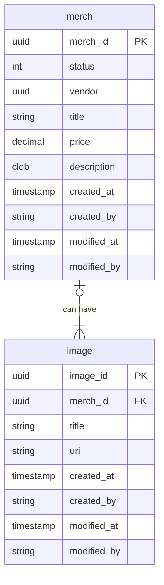

```mermaid
erDiagram
  merch {
    uuid merch_id PK
    int status
    uuid vendor
    string title
    decimal price
    clob description
    timestamp created_at
    string created_by
    timestamp modified_at
    string modified_by
  }
  image {
    uuid image_id PK
    uuid merch_id FK
    string title
    string uri
    timestamp created_at
    string created_by
    timestamp modified_at
    string modified_by
  }
  merch |o--|{ image : "can have"
```